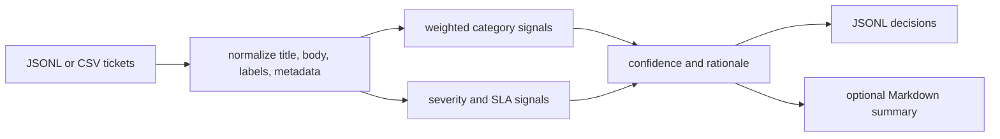

# ticket-router

`ticket-router` is a local-first CLI that routes support tickets into an owner, severity,
SLA, confidence score, and short rationale. It is built for teams that want predictable
ticket triage in CI jobs, internal automations, or data pipelines before adding an LLM layer.

## Why it is useful

Support queues often mix incidents, billing issues, auth bugs, security reports, docs
feedback, and feature requests. A small deterministic router gives you a fast baseline:
every decision is explainable, testable, and safe to run on private ticket exports.

## Features

- Routes JSONL or CSV tickets into category, owner, severity, SLA, confidence, and rationale.
- Uses weighted signals for security, incident, auth, billing, data, performance, devops,
  feature, and docs queues.
- Supports a custom JSON taxonomy for team-specific categories.
- Emits JSONL for downstream automation and an optional Markdown summary.
- Includes a confidence gate for CI workflows that should fail on ambiguous tickets.

## Installation

```bash
python -m pip install -e ".[dev]"
```

For normal usage without development tools:

```bash
python -m pip install .
```

## Usage

Route the bundled example tickets:

```bash
ticket-router route examples/tickets.jsonl --out routed.jsonl --summary triage-summary.md
```

Use CSV input:

```bash
ticket-router route tickets.csv --format csv --out routed.jsonl
```

Fail a workflow when any ticket is too ambiguous:

```bash
ticket-router route examples/tickets.jsonl --min-confidence 0.7
```

Add a custom category:

```bash
ticket-router route examples/tickets.jsonl \
  --taxonomy examples/custom-taxonomy.json \
  --out routed.jsonl
```

The package module also exposes help:

```bash
python -m ticket_router --help
```

## CLI options

```text
ticket-router route INPUT [--format auto|jsonl|csv] [--taxonomy PATH]
                          [--out PATH] [--summary PATH]
                          [--min-confidence FLOAT]
```

- `INPUT`: `.jsonl`, `.ndjson`, or `.csv` file containing tickets.
- `--format`: input format. `auto` infers from the file extension.
- `--taxonomy`: JSON file that adds or overrides routing categories and severity rules.
- `--out`: destination for routed JSONL. Defaults to stdout.
- `--summary`: optional Markdown report with category, severity, and low-confidence counts.
- `--min-confidence`: exits with code `2` if any route is below the threshold.

## Workflow



Each output row contains:

```json
{
  "ticket_id": "INC-1001",
  "category": "incident",
  "owner": "platform-oncall",
  "severity": "P0",
  "sla_hours": 1,
  "confidence": 0.91,
  "rationale": "Routed to platform-oncall as incident...",
  "matched_signals": ["outage:4", "all users:3.5"]
}
```

## Tests

```bash
ruff check .
pytest
python -m ticket_router --help
```

The tests cover routing decisions, low-confidence fallback, label boosts, custom taxonomy
loading, JSONL and CSV parsing, Markdown summary creation, and the confidence gate.

## License

MIT

