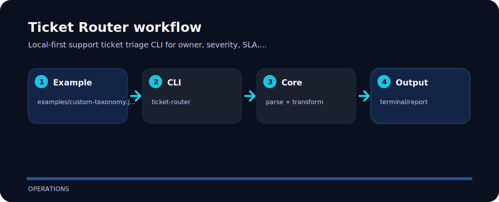

# Ticket Router


## Project flow



## Start here

```bash
git clone https://github.com/mertefekurt/ticket-router.git
cd ticket-router
python -m pip install -e ".[dev]"
ticket-router examples/custom-taxonomy.json
```

## Reading notes

This project is a small, inspectable operations tool. It prefers concrete examples and local files over hidden setup.

| Detail | Value |
| --- | --- |
| Area | operations |
| Entry | `ticket-router` |
| Input | JSON document |
| Output | readable terminal output |
